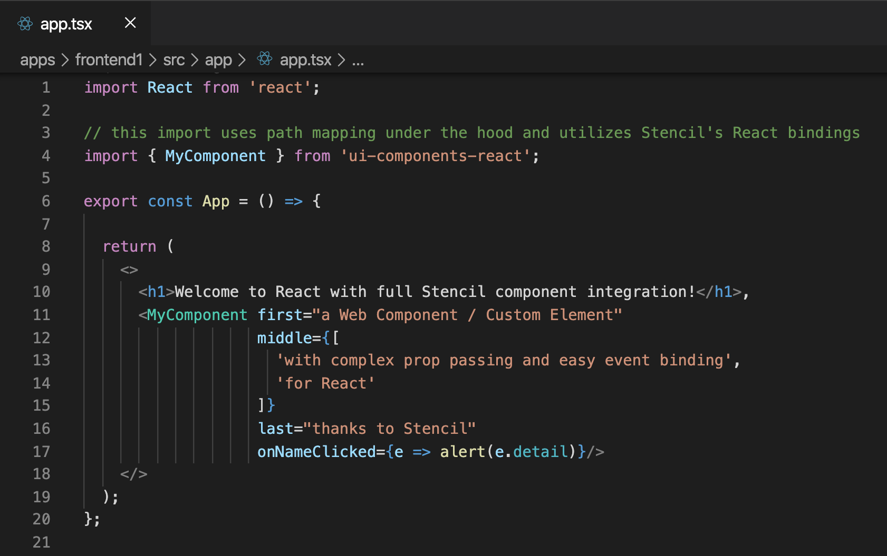

# How to use Stencil Web Components in React within a Nx Monorepo
### [Efficiently use Stencil Web Components in React (with typings)](https://medium.com/javascript-in-plain-english/how-to-use-stencil-web-components-in-react-within-a-nx-monorepo-d6644f6ee858?source=friends_link&sk=c6e9f1dfaf1083be2f5cf585ff1c3601)

This project generates React wrappers and typings from the Stencil component library for efficient use with TypeScript and TSX in React. ❤️

The benefit of using a Stencil component library is that Stencil compiles down to standards-compliant Web Components / Custom Elements, while at the same time it offers framework integrations for popular libraries such as React, Angular or Vue, which makes them easy to use across frameworks.

You can read more about this project setup in this [blog post](https://www.pertiller.tech/blog/stencil-web-components-in-react-apps-with-generated-react-wrappers-and-typings-for-efficient-use-with-typescript-and-tsx).

This project was generated using [Nx](https://nx.dev).

🔎 **Nx is a set of Extensible Dev Tools for Monorepos.**

## Updating the Stencil plugin
The Stencil plugin adds a lot of capabilities for efficiently working with Stencil, like component generation or support for Storybook. In order to benefit from new capabilities, run the provided Stencil migration which takes care of bringing you up-to-date:
`nx migrate @nxext/stencil`
  
After the migration, run `yarn install` to install the updated packages.

## Adding capabilities to your workspace

Nx supports many plugins which add capabilities for developing different types of applications and different tools.

These capabilities include generating applications, libraries, etc as well as the devtools to test, and build projects as well.

Below are some plugins which you can add to your workspace:

- [React](https://reactjs.org)
  - `npm install --save-dev @nrwl/react`
- Web (no framework frontends)
  - `npm install --save-dev @nrwl/web`
- [Angular](https://angular.io)
  - `npm install --save-dev @nrwl/angular`
- [Nest](https://nestjs.com)
  - `npm install --save-dev @nrwl/nest`
- [Express](https://expressjs.com)
  - `npm install --save-dev @nrwl/express`
- [Node](https://nodejs.org)
  - `npm install --save-dev @nrwl/node`

## Generate an application

Run `nx g @nrwl/react:app my-app` to generate an application.

> You can use any of the plugins above to generate applications as well.

When using Nx, you can create multiple applications and libraries in the same workspace.

## Generate a library

Run `nx g @nrwl/react:lib my-lib` to generate a library.

> You can also use any of the plugins above to generate libraries as well.

Libraries are sharable across libraries and applications. They can be imported from `@yourcompany/mylib`.

## Further help

Visit the [Nx Documentation](https://nx.dev) to learn more.

## Project Overview: 

This section introduces the project, explaining that it integrates Stencil Web Components within a React application hosted in an Nx monorepo. The project uses React for the frontend, while Stencil is used to create reusable web components. Apollo Client is utilized for fetching data from Contentful, and Algolia is implemented for search functionality.

## Workspace Initialization: 

The Nx workspace was created to manage multiple projects, including the React frontend and the Stencil library. The Nx toolset simplifies development, testing, and deployment processes within the monorepo.

## React Application Setup:

A React application named frontend1 was generated within the Nx workspace. This application serves as the main frontend, integrating the Stencil components and handling data display and user interactions.

## Stencil Library Creation: 

A Stencil library named ui-components was created to house all reusable web components, including the AssessmentComponent. These components are compiled to web standards, making them easy to use across different frameworks, including React.

## Data Fetching with Apollo Client: 
 
The project fetches assessment data from Contentful using Apollo Client. This setup allows for seamless integration of GraphQL queries to retrieve structured data, which is then passed to the Stencil components for rendering.

## Algolia Search Integration: 

The project also integrates Algolia for advanced search functionality. This allows for efficient real-time search capabilities within the application, filtering and displaying relevant results based on user inputs on different questions.

## Using Stencil Components in React: 

The React application (frontend1) efficiently uses the generated Stencil components, allowing for a seamless integration with TypeScript. The Stencil components are wrapped with React bindings, enabling their usage within React’s component ecosystem.

## Running and Building the Project: 

The Nx toolset provides commands to run and build the project, ensuring that all components and applications within the workspace can be developed and deployed efficiently.

## Development server

Run `nx serve frontend1` for a dev server. Navigate to http://localhost:4200/. The app will automatically reload if you change any of the source files.

## Code scaffolding

Run `nx g @nrwl/react:component my-component --project=my-app` to generate a new component.

## Build

Run `nx build frontend1` to build the project. The build artifacts will be stored in the `dist/` directory. Use the `--prod` flag for a production build.

## Running unit tests

Run `nx test frontend1` to execute the unit tests via [Jest](https://jestjs.io).

Run `nx affected:test` to execute the unit tests affected by a change.

## Running end-to-end tests

Run `ng e2e frontend1` to execute the end-to-end tests via [Cypress](https://www.cypress.io).

Run `nx affected:e2e` to execute the end-to-end tests affected by a change.

## Understand your workspace

Run `nx dep-graph` to see a diagram of the dependencies of your projects.
